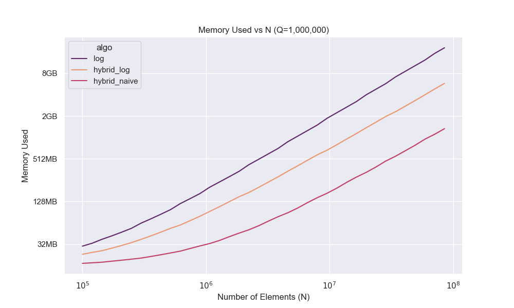

# RMQ - Range Minimum Query Algorithms

This project implements various Range Minimum Query (RMQ) algorithms in Go, focusing on different trade-offs between preprocessing time, query time, and memory usage. RMQ allows finding the minimum value in a given range of an array efficiently.

## Algorithms

1. **Naive RMQ** (`rmq.NewRMQNaive`):
   - **Description**: A simple implementation that scans the range for each query to find the minimum.
   - **Preprocessing**: O(1) time and space (just stores the array).
   - **Query Time**: O(r - l + 1) per query (linear in range size).
   - **Use Case**: Suitable for small arrays or when preprocessing is not feasible.

2. **Log RMQ** (`rmq.NewRMQLog`):
   - **Description**: Uses a sparse table to precompute minima for ranges of power-of-two lengths.
   - **Preprocessing**: O(n log n) time and space.
   - **Query Time**: O(1) per query.
   - **Use Case**: Good for static arrays where fast queries are needed.

3. **Hybrid Log RMQ** (`rmq.NewRMQHybrid`):
   - **Description**: Divides the array into blocks of size log n, uses RMQLog within blocks, and a top-level RMQLog on block minima.
   - **Preprocessing**: O(n log log n) time and space.
   - **Query Time**: O(1) worst-case.
   - **Use Case**: Balances preprocessing, memory and query efficiency for large arrays.

4. **Hybrid Naive RMQ** (`rmq.NewRMQHybridNaive`):
   - **Description**: Similar to Hybrid Log, but uses RMQNaive within blocks.
   - **Preprocessing**: O(n) time, O(n) space (for the top sparse table).
   - **Query Time**: O(log n) worst-case.
   - **Use Case**: When memory is a concern

## Benchmarks

The project includes benchmarking tools to measure performance across different array sizes (N) and query counts (Q), tracking construction time, query time, current memory, and peak memory.

### Prerequisites
- Go installed
- Python 3 with `venv` support
- Install Python dependencies: `matplotlib`, `pandas` and `seaborn`

### Setting Up and Running Benchmarks

1. **Set up Python virtual environment**:
   ```bash
   python3 -m venv venv
   source venv/bin/activate
   pip install matplotlib pandas seaborn
   ```

2. **Run the benchmarks and generate plots**:
   ```bash
   make
   ```
   This will:
   - Run the Go benchmark program to generate `bench.csv`.
   - Use the Python script to generate plots in the `plots/` directory.

3. **Clean up**:
   ```bash
   make clean
   ```
   Removes generated CSV and plots.

The benchmarks vary N with fixed Q=1,000,000 and vary Q with fixed N=1,000,000, starting from N,Q >= 100,000. Results are plotted for construction time, query time and memory usage.

## Benchmark Results

### System Specifications

- **OS**: macOS 15.5 (build 24F74)
- **CPU**: Apple M4 Max (16 cores)
- **RAM**: 64 GB
- **Go Version**: go1.24.4
- **Python Version**: 3.13.3

### Construction Time vs. N (Q=1,000,000)


### Memory Usage vs. N (Q=1,000,000)


### Query Time vs. N (Q=1,000,000)


### Query Time vs. Q (N=1,000,000)


## License
MIT License - see LICENSE file. 